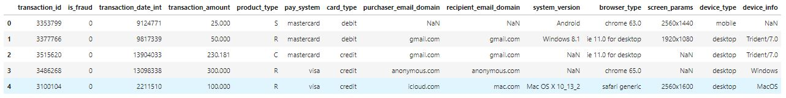
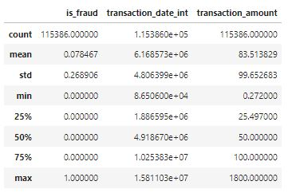
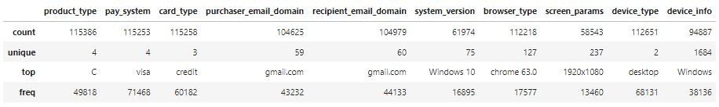
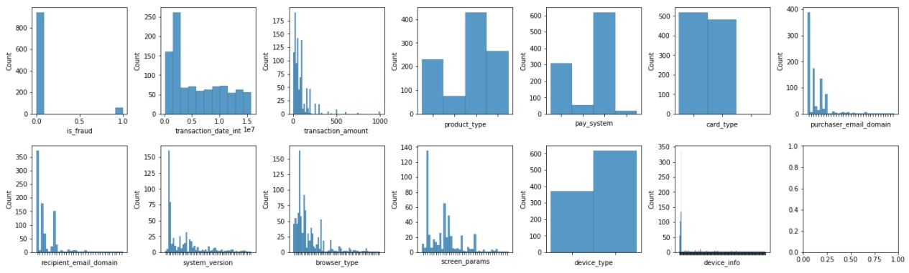
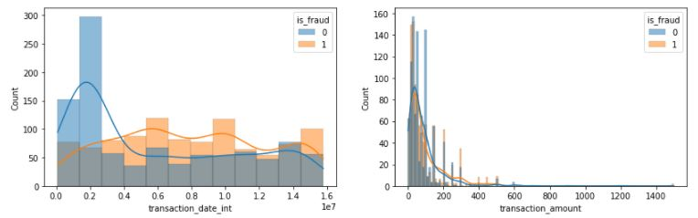
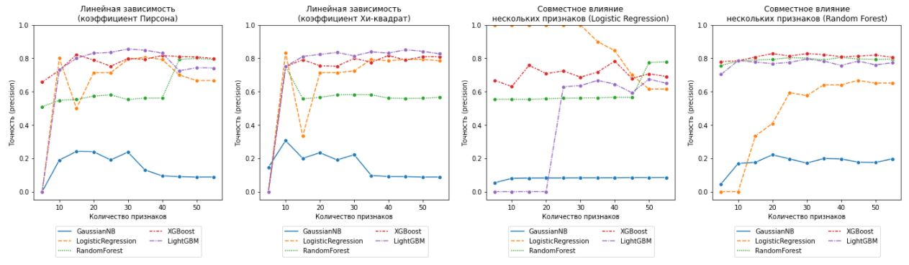
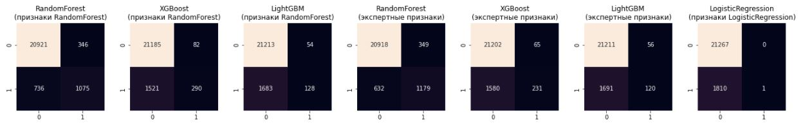

# Поиск подозрительных транзакций
Построить алгоритм поиска «подозрительных» транзакций клиентов, которые тратили бонусные баллы со своих пластиковых карт в магазинах. Оценка качества алгоритма - площадь под ROC-кривой (AUC-ROC).

**Входные данные:**
- **TRANSACTION_ID** - идентификатор транзакции
- **IS_FRAUD** - метка «подозрительной операции»
- **TRANSACTION_DATE_IN** - дата транзакции в числовом формате
- **TRANSACTION_AMOUNT** - объем транзакции в валюте
- **PRODUCT_TYPE** - тип продукта в покупке
- **PAY_SYSTEM** - тип системы оплаты
- **CARD_TYPE** - тип пластиковой карты
- **PURCHASER_EMAIL_DOMAIN** - домен отправителя средств
- **RECIPIENT_EMAIL_DOMAIN** - домен получателя средств
- **SYSTEM_VERSION** - версия операционной системы устройства
- **BROWSER_TYPE** - тип браузера на устройстве
- **SCREEN_PARAMS** - разрешение экрана устройства
- **DEVICE_TYPE** - тип устройства
- **DEVICE_INFO** - информация об устройстве

## Подключение библиотек
```python
# Импорт основных библиотек
import numpy as np
import pandas as pd
import re

# Импорт библиотеки научных расчетов
import scipy.stats as sps

# Импорт библиотек машинного обучения
from sklearn.preprocessing import MinMaxScaler
from sklearn.model_selection import train_test_split
from sklearn.metrics import confusion_matrix, accuracy_score, precision_score, recall_score
from sklearn.ensemble import GradientBoostingClassifier, RandomForestClassifier
from sklearn.feature_selection import RFE, SelectKBest, chi2
from sklearn.linear_model import LogisticRegression
from sklearn.naive_bayes import GaussianNB
from xgboost import XGBClassifier
from lightgbm import LGBMClassifier

# Импорт библиотеки построения диаграмм и графиков
from matplotlib import pyplot as plt
import seaborn as sns

# Указание режима отображения диаграмм
%matplotlib inline

# Установка начального значения генератора случайных чисел
np.random.seed(42)
```

## Загрузка исходных данных
```python
# Загрузка исходных данных по транзакциям клиентов
data_classification = pd.read_csv('data_classification_train.csv')

# Вывод загруженных данных
data_classification.head()
```


```python
# Удаление признака "transaction_id", поскольку признак не несёт никакой информации
data_classification.drop(columns=['transaction_id'], inplace=True)
```

## Разведочный анализ
```python
# Сводная информация о структуре исходных данных
data_classification.info()
```
```
<class 'pandas.core.frame.DataFrame'>
RangeIndex: 115386 entries, 0 to 115385
Data columns (total 13 columns):
 #   Column                  Non-Null Count   Dtype  
---  ------                  --------------   -----  
 0   is_fraud                115386 non-null  int64  
 1   transaction_date_int    115386 non-null  int64  
 2   transaction_amount      115386 non-null  float64
 3   product_type            115386 non-null  object 
 4   pay_system              115253 non-null  object 
 5   card_type               115258 non-null  object 
 6   purchaser_email_domain  104625 non-null  object 
 7   recipient_email_domain  104979 non-null  object 
 8   system_version          61974 non-null   object 
 9   browser_type            112218 non-null  object 
 10  screen_params           58543 non-null   object 
 11  device_type             112651 non-null  object 
 12  device_info             94887 non-null   object 
dtypes: float64(1), int64(2), object(10)
memory usage: 11.4+ MB
```

```python
# Вывод доли отсутствующих данных в признаках
data_classification.isna().sum() / len(data_classification)
```
```
is_fraud                  0.000000
transaction_date_int      0.000000
transaction_amount        0.000000
product_type              0.000000
pay_system                0.001153
card_type                 0.001109
purchaser_email_domain    0.093261
recipient_email_domain    0.090193
system_version            0.462898
browser_type              0.027456
screen_params             0.492633
device_type               0.023703
device_info               0.177656
dtype: float64
```

```python
# Вывод доли обычных и подозрительных транзакций 
data_classification['is_fraud'].value_counts() / len(data_classification)
```
```
0    0.921533
1    0.078467
Name: is_fraud, dtype: float64
```

```python
# Вывод основных статистик по количественным признакам
data_classification.describe(include=[np.number])
```


```python
# Вывод основных статистик по категориальным и строковым признакам
data_classification.describe(include=[object])
```


```python
# Определение основных объектов диаграмм
fig, axes = plt.subplots(2, 7, figsize=(24, 7))

# Построение гистограмм распределения данных в признаках
for ax, column in zip(axes.flat, data_classification.columns):
    sns.histplot(data_classification.sample(n=1000, random_state=42)[column], linewidth=0.1, ax=ax)
    if data_classification[column].dtype == 'O':
        ax.set_xticklabels([])

# Увеличение расстояния между диаграммами
plt.subplots_adjust(hspace=0.3, wspace=0.35)
    
# Вывод диаграммы
plt.show()
```

Далее рассмотрим как распределились количественные признаки по отношению к целевой переменной. Насколько разные распределения признаков **transaction_date_int** и **transaction_amount** для обычных и подозрительных операций. Выдвинем нулевую гипотезу о том, что матожидание в обеих выборках равны. Гипотезу проверим с помощью доверительных интервалов и критерия Вилкоксона (Манна-Уитни).

```python
# Определение основных объектов диаграмм
fig, axes = plt.subplots(1, 2, figsize=(14, 4))

# Определение индексов подозрительных транзакций
indx = data_classification['is_fraud']==1

# Вывод распределений признаков в разрезе обычных и подозрительных транзакций
for column, ax in zip(['transaction_date_int', 'transaction_amount'], axes.flatten()):
    samples_df = data_classification.loc[
        (indx[indx].sample(n=1000)|indx[~indx].sample(n=1000)).index, 
        ['is_fraud', column]]
    sns.histplot(samples_df, x=column, hue='is_fraud', linewidth=0.1, kde=True, ax=ax)

# Вывод диаграммы
plt.show()
```


```python
# Вывод доверительных интервалов и критерия Вилкоксона для выборок 
for column in ['transaction_date_int', 'transaction_amount']:
    # Разделение исходных данных на выборку подозрительных и обычных транзакций
    fraud_sample = data_classification.loc[indx, column]
    nofraud_sample = data_classification.loc[~indx, column]
    
    # Вывод статистических оценок
    print('Признак', column)
    print('-------------------------------')
    print('Доверительный интервал для подозрительных транзакций (alpha=0.05): ({:.0f}, {:.0f})'.format(
        *sps.norm.interval(0.95, loc=fraud_sample.mean(), scale=sps.sem(fraud_sample))))
    print('Доверительный интервал для обычных транзакций (alpha=0.05): ({:.0f}, {:.0f})'.format(
        *sps.norm.interval(0.95, loc=nofraud_sample.mean(), scale=sps.sem(nofraud_sample))))
    print('Критерий Уилкоксона (Манна-Уитни): p-value={:.4f} \n'.format(
        sps.mannwhitneyu(fraud_sample, nofraud_sample).pvalue))
```
```
Признак transaction_date_int
-------------------------------
Доверительный интервал для подозрительных транзакций (alpha=0.05): (7574075, 7756808)
Доверительный интервал для обычных транзакций (alpha=0.05): (6012175, 6070060)
Критерий Уилкоксона (Манна-Уитни): p-value=0.0000 

Признак transaction_amount
-------------------------------
Доверительный интервал для подозрительных транзакций (alpha=0.05): (87, 91)
Доверительный интервал для обычных транзакций (alpha=0.05): (82, 84)
Критерий Уилкоксона (Манна-Уитни): p-value=0.0005 
```
Исходя из полученных оценок видно, что доверительные интервалы на уровне значимости 0.05 не пересекаются, следовательно нулевая гипотеза о равенстве распределений отвергается в пользу альтернативной. Критерий Уилкоксона (p-value) также показывает неравенство выборок. Можно с уверенностью сказать, что признаки **transaction_date_int** и **transaction_amount** полезны для модели и будут вносить большой вклад в разделение транзакций на обычные и подозрительные.

Далее определим степень влияния категориальных признаков на целевую переменную, а также выделим важные признаки повышающие качество модели классификации.

```python
# Определение силы зависимости признаков с целевой переменной
for column in data_classification.columns[data_classification.dtypes==object]:
    # Построение матрицы сопряженности
    matrix = pd.get_dummies(data_classification[['is_fraud', column]]).values
    
    # Вычисление статистики Хи-квадрат, p-value и коэффициента связи Крамера
    stat, p, _, _ = sps.chi2_contingency(np.dot(np.vstack([1-matrix[:, 0], matrix[:, 0]]), matrix[:, 1:]))
    kramer = np.sqrt(stat/(matrix.sum()*(np.min(matrix.shape)-1)))
    
    # Вывод статистических оценок
    print('Признак {:<24} Коэффициент Крамера: {:<6.3f} p-value: {:.4f}'.format(column, kramer, p))
```
```
Признак product_type             Коэффициент Крамера: 0.069  p-value: 0.0000
Признак pay_system               Коэффициент Крамера: 0.023  p-value: 0.0000
Признак card_type                Коэффициент Крамера: 0.022  p-value: 0.0000
Признак purchaser_email_domain   Коэффициент Крамера: 0.020  p-value: 0.0000
Признак recipient_email_domain   Коэффициент Крамера: 0.021  p-value: 0.0000
Признак system_version           Коэффициент Крамера: 0.017  p-value: 0.0000
Признак browser_type             Коэффициент Крамера: 0.016  p-value: 0.0000
Признак screen_params            Коэффициент Крамера: 0.014  p-value: 0.0000
Признак device_type              Коэффициент Крамера: 0.045  p-value: 0.0000
Признак device_info              Коэффициент Крамера: 0.009  p-value: 0.0000
```
Исследование категориальных признаков на зависимость с целевой переменной показывает, что все без исключения признаки связаны с целевой переменной (p-value < 0.05). Коэффициент связи Крамера показывает силу этой зависимости. Соответственно можно выделить только два категориальных признака с сильной связью: **product_type** и **device_type**. 

Подводя итоги исследования признаков, можно обозначить, что признаки: **transaction_date_int**, **transaction_amount**, **product_type**, **device_type** будут давать наибольший вклад в модель классификации.

```python
# Перемещение важных признаков в начало датасета с целью
# избежания их исключения при сильной корреляции с другими признаками
data_classification = data_classification[[
    'is_fraud', 'transaction_date_int', 'transaction_amount', 'product_type', 'device_type', 'pay_system', 'card_type',
    'purchaser_email_domain', 'recipient_email_domain', 'system_version', 'browser_type', 'screen_params', 'device_info']]

# Объединение (укрупнение) значений в категориальных признаках 
data_classification['system_version'] = data_classification['system_version'].str.findall('^\w*').str.join('')
data_classification['screen_params'] = data_classification['screen_params'].str.findall('^\d?').str.join('') + 'XXX'
data_classification['browser_type'] = data_classification['browser_type'].str.findall('^\w*').str.join('')

# Удаление признака device_info, ввиду большого числа уникальных значений признака
data_classification.drop(columns=['device_info'], inplace=True)
```
Преобразуем категориальные и текстовые данные в бинарные признаки для последующего их использования в моделях классификации.

```python
# Преобразование категориальных признаков в бинарные признаки
dummies_features = pd.get_dummies(data_classification, drop_first=True)
```
Используя коэффициент корреляции Пирсона удалим избыточные признаки, что позволит лучше понять данные, сократить время настройки модели и повысить ее точность.

```python
# Построение матрицы корреляций для исходных данных
corr_matrix = np.abs(dummies_features.corr())

# Удаление из исходных данных сильно коррелирующих признаков
for column in corr_matrix.columns[1:]:
    indx = (corr_matrix[column] > 0.5) & (corr_matrix[column] < 1)
    if len(indx) > 0:
        corr_matrix.loc[:, corr_matrix[indx].index] = 0
        corr_matrix.loc[corr_matrix[indx].index, :] = 0

transform_data = dummies_features.drop(columns=corr_matrix[corr_matrix.sum(axis=0)==0].index)
```

## Предобработка данных
```python
# Нормализация значений признаков
X_data = MinMaxScaler().fit_transform(transform_data.iloc[:, 1:])
Y_data = transform_data.iloc[:, 0]

# Разбиение исходных данных на тренировочную и контрольную выборки
X_train, X_test, Y_train, Y_test = train_test_split(X_data, Y_data, train_size=0.8, stratify=Y_data, random_state=42)

# Подготовка датасетов для последующей вариации признаков
X_train_df = pd.DataFrame(X_train, columns=[transform_data.columns[1:]])
X_test_df = pd.DataFrame(X_test, columns=[transform_data.columns[1:]])
```
Через коэффициент корреляции Пирсона и Xи-квадрат выберем признаки, которые имеют сильную степень линейной зависимости с целевой переменной.

```python
# Определение коэффициента корреляции Пирсона
pearson_features = corr_matrix['is_fraud'].sort_values(ascending=False)[1:].index

# Определение критерия Хи-квадрат Пирсона
chi2_features = pd.Series(
    SelectKBest(chi2, k='all').fit(X_train, Y_train).scores_, index=transform_data.columns[1:]
).sort_values(ascending=False).index
```
Методы фильтрации на основе статистических критериев не способны уловить совместное влияние нескольких признаков на целевую переменную. Определим подмножество признаков, на котором точность предсказания будет наивысшей.

```python
# Определение коэффициента важности признаков методом логистической регрессии
lgr_features = pd.Series(
    np.abs(LogisticRegression(solver='liblinear', penalty='l1', random_state=42).fit(X_train, Y_train).coef_[0]),
    index=transform_data.columns[1:]
).sort_values(ascending=False).index

# Определение коэффициента важности признаков методом решающих деревьев
tree_features = pd.Series(
    RFE(RandomForestClassifier(random_state=42, n_jobs=-1), n_features_to_select=1).fit(X_train, Y_train).ranking_, 
    index=transform_data.columns[1:]
).sort_values().index
```
## Построение модели
Поскольку классы несбалансированные (доля «подозрительных» транзакций составляет 0.078), модели не обладая никакой предсказательной силой будут выдавать правильные ответы с долей 0.92. Преодолеть это поможет переход с общей для всех классов метрики к отдельным показателям качества классов. Наши модели бинарной классификации будем оценивать по метрике **Precision**. Метрика **Accuracy** в нашем случае будет бесполезна.

```python
# Определение алгоритмов бинарной классификации данных
models = [GaussianNB(),
          LogisticRegression(solver='liblinear', penalty='l1', random_state=42),
          RandomForestClassifier(random_state=42, n_jobs=-1),
          XGBClassifier(eval_metric='error', use_label_encoder=False, random_state=42),
          LGBMClassifier(random_state=42)]

# Определение количества итераций
iterations = range(5, 60, 5)
pearson_scores, chi2_scores, lgr_scores, tree_scores, gb_scores = [], [], [], [], []

# Расчет оценок качества классификации моделей машинного обучения
for i in iterations:
    pearson_scores.append([
        precision_score(
            Y_test, model.fit(X_train_df[pearson_features[:i]].values, Y_train).predict(X_test_df[pearson_features[:i]].values), zero_division=0
        ) for model in models
    ])
    chi2_scores.append([
        precision_score(
            Y_test, model.fit(X_train_df[chi2_features[:i]].values, Y_train).predict(X_test_df[chi2_features[:i]].values), zero_division=0
        ) for model in models
    ])
    lgr_scores.append([
        precision_score(
            Y_test, model.fit(X_train_df[lgr_features[:i]].values, Y_train).predict(X_test_df[lgr_features[:i]].values), zero_division=0
        ) for model in models
    ])
    tree_scores.append([
        precision_score(
            Y_test, model.fit(X_train_df[tree_features[:i]].values, Y_train).predict(X_test_df[tree_features[:i]].values), zero_division=0
        ) for model in models
    ])

# Определение основных объектов диаграмм
fig, axes = plt.subplots(1, 4, figsize=(24,5))

# Определение списка наименований моделей классификации
model_names = ['GaussianNB', 'LogisticRegression',
               'RandomForest', 'XGBoost', 'LightGBM']

# Построение графиков зависимости коэффициента от количества признаков
sns.lineplot(data=pd.DataFrame(pearson_scores, columns=model_names, index=iterations), marker='o', ax=axes[0])
sns.lineplot(data=pd.DataFrame(chi2_scores, columns=model_names, index=iterations), marker='o', ax=axes[1])
sns.lineplot(data=pd.DataFrame(lgr_scores, columns=model_names, index=iterations), marker='o', ax=axes[2])
sns.lineplot(data=pd.DataFrame(tree_scores, columns=model_names, index=iterations), marker='o', ax=axes[3])

# Вывод заголовков и подписей осей координат
axes[0].set(title='Линейная зависимость\n(коэффициент Пирсона)', xlabel='Количество признаков', ylabel='Точность (precision)', ylim=(-0.05, 1))
axes[1].set(title='Линейная зависимость\n(коэффициент Хи-квадрат)', xlabel='Количество признаков', ylabel='Точность (precision)', ylim=(-0.05, 1))
axes[2].set(title='Совместное влияние\nнескольких признаков (Logistic Regression)', xlabel='Количество признаков', ylabel='Точность (precision)', ylim=(-0.05, 1))
axes[3].set(title='Совместное влияние\nнескольких признаков (Random Forest)', xlabel='Количество признаков', ylabel='Точность (precision)', ylim=(-0.05, 1))

# Вывод легенд
axes[0].legend(loc=2, ncol=2, bbox_to_anchor=(0.1, -0.13))
axes[1].legend(loc=2, ncol=2, bbox_to_anchor=(0.1, -0.13))
axes[2].legend(loc=2, ncol=2, bbox_to_anchor=(0.1, -0.13))
axes[3].legend(loc=2, ncol=2, bbox_to_anchor=(0.1, -0.13))

# Вывод диаграмм
plt.show()
```

Вышеполученные результаты показывают, что разные алгоритмы отбора признаков дают разное качество моделей, а количество признаков может как повышать, так и понижать точность модели. Использование статистической оценки в отборе признаков дает большой разброс точности в моделях. Признаки полученные с помощью логистической регрессии также показывают большой разброс, но сам алгоритм логистической регрессии показывает очень хорошие результаты в точности прогноза. Также следует отметить алгоритм отбора признаков Random Forest, который дает хороший минимальный набор значимых признаков для построения качественной модели классификации. В последующем анализе будем использовать только те признаки, которые получены с помощью алгоритмов Logistic Regression и Random Forest. 

На сколько необходим отбор признаков и на сколько качество моделей классификации с отобранными признаками лучше моделей обученных на всем наборе признаков? И какой точностью обладают модели при использовании признаков отобранных в ходе исследования (экспертные признаки)?

Далее сравним все эти варианты и найдем оптимальную модель по метрикам **precision** и **recall**.

```python
# Нормализация значений признаков
X_temp = MinMaxScaler().fit_transform(dummies_features.iloc[:, 1:])
Y_temp = dummies_features.iloc[:, 0]

# Разбиение исходных данных на тренировочную и контрольную выборки
X_temp_train, X_temp_test, Y_temp_train, Y_temp_test = train_test_split(X_temp, Y_temp, train_size=0.8, stratify=Y_temp, random_state=42)

# Вывод заголовка таблицы метрик
print('\033[1m' + 'Оценка моделей на всем наборе признаков' + '\033[0m')

# Расчет оценок качества классификации моделей машинного обучения
for name, model in zip(model_names, models):
    model_pred = model.fit(X_temp_train, Y_temp_train).predict(X_temp_test)
    print('{:<19}:  precision = {:.2f}  recall = {:.2f}'.format(
        name, precision_score(Y_temp_test, model_pred, zero_division=0), recall_score(Y_temp_test, model_pred)))
```
```
Оценка моделей на всем наборе признаков
GaussianNB         :  precision = 0.08  recall = 0.99
LogisticRegression :  precision = 0.53  recall = 0.02
RandomForest       :  precision = 0.81  recall = 0.59
XGBoost            :  precision = 0.78  recall = 0.17
LightGBM           :  precision = 0.79  recall = 0.13
```

```python
# Список прогнозных значений целевой переменной
model_pred = []

# Вывод заголовка таблицы метрик
print('\033[1m' + 'Оценка моделей на признаках отобранных RandomForest' + '\033[0m')

# Расчет оценок качества классификации моделей машинного обучения
for name, model in zip(model_names, models):
    model_pred.append(model.fit(X_train_df[tree_features[:5]].values, Y_train).predict(X_test_df[tree_features[:5]].values))
    print('{:<19}:  precision = {:.2f}  recall = {:.2f}'.format(
        name, precision_score(Y_test, model_pred[len(model_pred)-1], zero_division=0), recall_score(Y_test, model_pred[len(model_pred)-1])))
```
```
Оценка моделей на признаках отобранных RandomForest
GaussianNB         :  precision = 0.05  recall = 0.00
LogisticRegression :  precision = 0.00  recall = 0.00
RandomForest       :  precision = 0.76  recall = 0.59
XGBoost            :  precision = 0.78  recall = 0.16
LightGBM           :  precision = 0.70  recall = 0.07
```

```python
# Набор экспертных признаков полученных в результате исследования
expert_features = ['transaction_date_int', 'transaction_amount',
                   'product_type_H', 'product_type_S', 'device_type_mobile']

# Вывод заголовка таблицы метрик
print('\033[1m' + 'Оценка моделей на экспертных признаках' + '\033[0m')

# Расчет оценок качества классификации моделей машинного обучения
for name, model in zip(model_names, models):
    model_pred.append(model.fit(X_train_df[expert_features].values, Y_train).predict(X_test_df[expert_features].values))
    print('{:<19}:  precision = {:.2f}  recall = {:.2f}'.format(
        name, precision_score(Y_test, model_pred[len(model_pred)-1], zero_division=0), recall_score(Y_test, model_pred[len(model_pred)-1])))
```
```
Оценка моделей на экспертных признаках
GaussianNB         :  precision = 0.04  recall = 0.00
LogisticRegression :  precision = 0.00  recall = 0.00
RandomForest       :  precision = 0.77  recall = 0.65
XGBoost            :  precision = 0.78  recall = 0.13
LightGBM           :  precision = 0.68  recall = 0.07
```
Результаты оценок качества моделей с отобранными признаками и без отбора признаков показывают примерно одинаковый результат, за исключением LogisticRegression и LightGBM. Поскольку модели показывают примерно одинаковый результат, из последующего анализа исключаем модели без отбора признаков. Также в последующем анализе будем использовать не более 5-ти признаков, т.к. увеличение количества признаков не дает прироста качества моделей.

Произведем оценку моделей, показавших хороший результат на матрице ошибок.

```python
# Определение размера диаграммы
fig, axes = plt.subplots(1, 7, figsize=(24, 2.8))

# Определение заголовков диаграмм
titles = ['(признаки RandomForest)']*3 + ['(экспертные признаки)']*3

# Выборка прогноза моделей показавших хороший результат
slice_pred = model_pred[2:5] + model_pred[7:10]

# Вывод матриц ошибок для моделей классификации
for i, (name, title) in enumerate(zip(model_names[2:] * 2, titles)):
    sns.heatmap(confusion_matrix(Y_test, slice_pred[i]), fmt='d', square=True, cbar=False, annot=True, ax=axes[i])
    axes[i].set_title('{}\n{}'.format(name, title))

# Вывод матриц ошибок для логистической регрессии
lgr_pred = models[1].fit(X_train_df[lgr_features[:5]].values, Y_train).predict(X_test_df[lgr_features[:5]].values)
sns.heatmap(confusion_matrix(Y_test, lgr_pred), fmt='d', square=True, cbar=False, annot=True, ax=axes[i+1])
axes[i+1].set_title('LogisticRegression\n(признаки LogisticRegression)'.format(name, title))

# Вывод диаграммы
plt.show()
```

В соответствии с полученными матрицами ошибок можно утверждать, что модель построенная на алгоритме **RandomForest** дает лучшее качество классификации **подозрительных операций** как для признаков полученных с помощью алгоритма отбора RandomForest, так и для экспертных признаков.

Далее рассмотрим только модель RandomForest и повысим точность прогнозирования модели с помощью увеличения порога определения единиц.

```python
# Порог классификации единиц
threshold = 0.8

# Вывод заголовка таблицы метрик
print('\033[1m' + 'Модель RandomForest' + '\033[0m')

# Вывод оценок качества классификации модели обученной на признаках RandomForest
model = models[2].fit(X_train_df[tree_features[:5]].values, Y_train)
model_pred = model.predict_proba(X_test_df[tree_features[:5]].values)[:, 1] > threshold
print('Обучение на признаках RandomForest:  precision = {:.2f}  recall = {:.2f}'.format(
        precision_score(Y_test, model_pred, zero_division=0), recall_score(Y_test, model_pred)))

# Вывод оценок качества классификации модели обученной на экспертных признаках
model = models[2].fit(X_train_df[expert_features].values, Y_train)
model_pred = model.predict_proba(X_test_df[expert_features].values)[:, 1] > threshold
print('Обучение на экспертных признаках:    precision = {:.2f}  recall = {:.2f}'.format(
        precision_score(Y_test, model_pred, zero_division=0), recall_score(Y_test, model_pred)))
```
```
Модель RandomForest
Обучение на признаках RandomForest:  precision = 0.91  recall = 0.33
Обучение на экспертных признаках:    precision = 0.91  recall = 0.42
```
## Выводы
Из вышепроведенного исследования и полученных результатов следует, что **модель RandomForest** обученная на **экспертных признаках** (признаки полученные в ходе исследования) дает лучшую точность (precision) и полноту (recall).
